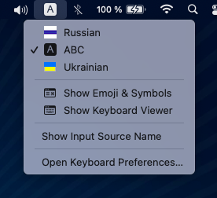

# FutureRussia-macOS-Keyboard-Layout
FutureRussia macOS Keyboard Layout with the flag without a red bar

This is the standard [ukelele](https://software.sil.org/ukelele/) based Russian keyboard layout for MacOS, but flag icons without a red bar mean we are against war. The author of the flag idea: *Please let me know the name*
  

  
## Installation
- Download [FutureRussia.bundle.zip](FutureRussia.bundle.zip) file an unarchive it
- Double-click `FutureRussia.bundle` to install it
- Change Keyboard preferences to configure it
